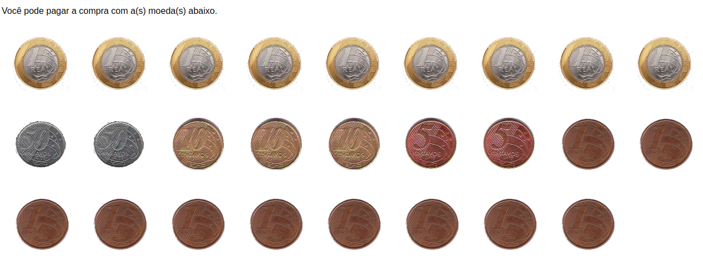

# TROCO

**Número da Lista**: 5 
**Conteúdo da Disciplina**: Programção Dinâmica 

## Alunos
|Matrícula | Aluno |
| -- | -- |
| 16/0014433  |  Maria Luiza Ferreira Assumpção Almeida |
| 15/0009313  |  Felipe de Oliveira Hargreaves |

## Sobre 
Este trabalho foi uma adaptação do problema do [URI do Troco](https://www.urionlinejudge.com.br/judge/pt/problems/view/2446). A descrição do problema  a seguinte: "Você está num supermercado e está na fila do caixa para comprar alguns produtos. Assim que você termina de passar as compras pelo caixa, se lembra que tem várias moedas em seu bolso, algumas repetidas, e fica pensando se com elas dá para pagar exatamente o valor das compras (para assim se livrar destas moedas e ficar com os bolsos mais leves). Você consegue pagar o valor exato da conta usando estas moedas?"

Então, foi feito um problema para que seja inserido o valor da compra em REAIS e a quantidade de cada moeda que você tem em seu bolso. O sistema utiliza o algoritmo de Subset Sum (ou Soma de Subconjuntos) para resolver. Este algoritmo é um caso especial do problema da mochila booleana. Após a inserção dos dados o algoritmo retorna uma possível solução para pagar a compra com as moedas e se livrar delas.

## Screenshots
Imagem da tela inicial do sistema 

Imagem com os valores preenchidos

Imagem com o resultado obtido 

## Instalação 
**Linguagem**: HTML/JS 

1) Clonar o repositório
2) Abrir o arquivo HTML que está na pasta templates no browser

## Uso 
O usuário deve inserir o valor da compra em REAIS e a quantidade de cada moeda que você tem em seu bolso. Após a inserção dos dados o algoritmo retorna uma possível solução para pagar a compra com as moedas e se livrar delas.

